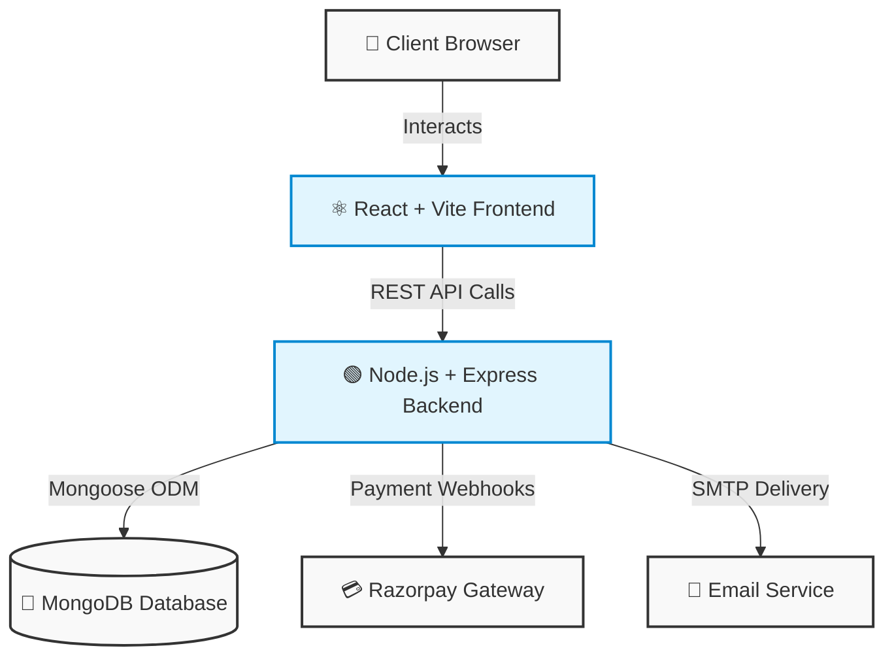
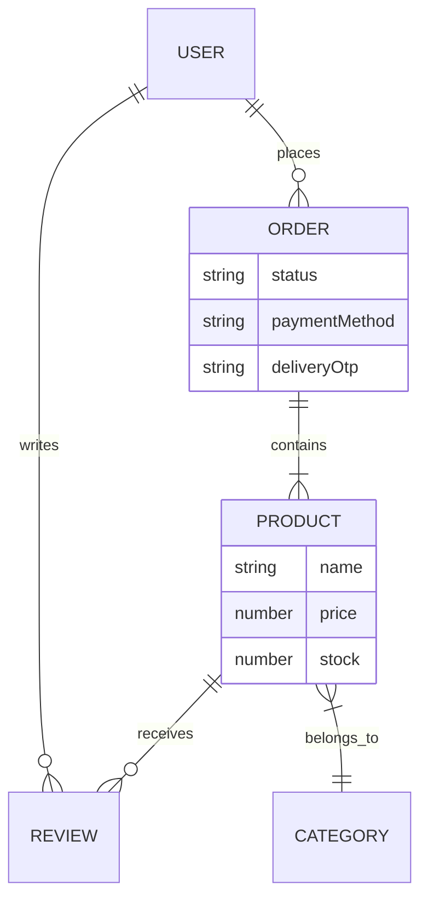

  
  <h1>🧸 ToyBox Store</h1>
  
<em>Premium Kids E-Commerce Platform</em>

  
  

    
    
    
    
  

---

> **ToyBox** is a modern, full-stack e-commerce platform dedicated to children's toys and educational games. Designed with a premium, engaging user interface and backed by a robust, secure backend architecture.

## 🌐 Live Environments

| Environment | Status | Link |
| :--- | :---: | :--- |
| **Frontend (Client)** | 🟢 Active | [https://toyboxx.vercel.app](https://toyboxx.vercel.app) |
| **Backend (API)** | 🟢 Active | [https://toybox-lkdi.onrender.com](https://toybox-lkdi.onrender.com) |

---

## 🏗️ System Architecture

Our platform utilizes a decoupled client-server architecture built on the MERN stack, ensuring high scalability and blazing-fast performance.

---

## 🗄️ Database Architecture

The data layer is driven by MongoDB NoSQL collections, efficiently linking entities to handle rapid commerce transactions.

---

## ✨ Core Features

<table>
  <tr>
    <td width="50%">
      <h3>🛍️ For Customers</h3>
      <ul>
        <li><b>Stunning UI/UX:</b> Glassmorphism & smooth animations.</li>
        <li><b>Smart Discovery:</b> Live Pincode delivery checking.</li>
        <li><b>Secure Checkout:</b> Razorpay and COD support.</li>
        <li><b>Account:</b> Order tracking & verified reviews.</li>
      </ul>
    </td>
    <td width="50%">
      <h3>🛡️ For Administrators</h3>
      <ul>
        <li><b>Live Analytics:</b> Recharts data visualization.</li>
        <li><b>Control Room:</b> OTP-secured delivery dispatching.</li>
        <li><b>Inventory:</b> Complete CRUD for toys & categories.</li>
        <li><b>Finances:</b> Force-update settlement tracking.</li>
      </ul>
    </td>
  </tr>
</table>

---

## 🚀 Quick Start Guide

Follow these steps to safely configure and run the complete MERN application on your local machine using a single unified command!

### 1. Clone the Repository
\`\`\`bash
git clone https://github.com/yourusername/toybox.git
cd toybox
\`\`\`

### 2. Install All Dependencies
The project is configured with a root script to install dependencies for both the frontend and backend simultaneously:
\`\`\`bash
npm run install:all
\`\`\`

### 3. Configure Environment Variables
Before running the app, you must provide your database credentials and API keys. 
Navigate to the `backend` folder, copy the provided example environment file, and add your actual keys:

\`\`\`bash
cd backend
cp .env.example .env
\`\`\`

Open the `.env` file in your code editor and update the placeholders (`MONGO_URI`, `JWT_SECRET`, Razorpay Keys, etc.) with your actual credentials.

### 4. Start the Application
Go back to the root `toybox` directory and run the unified start command. This uses `concurrently` to boot up both the Node.js backend and the React Vite frontend in the exact same terminal!
\`\`\`bash
cd ..
npm run dev
\`\`\`
> ✅ *If successful, the terminal will show both "MongoDB Connected" and the Vite local URL simultaneously.*

🎉 **You're all set!** Open your browser and visit \`http://localhost:3000\` to start shopping.

---

  <i>Built with ❤️ for kids.</i>

